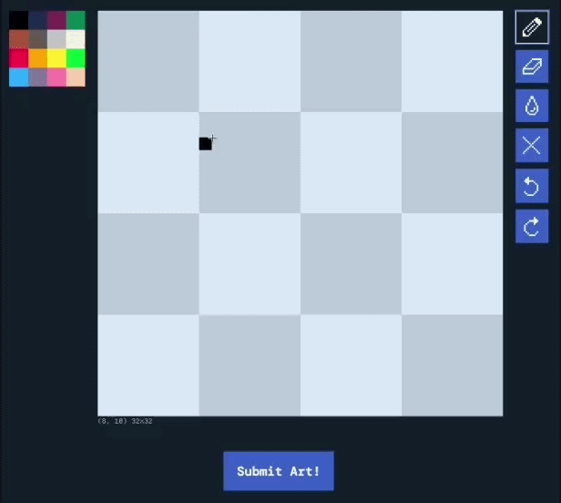
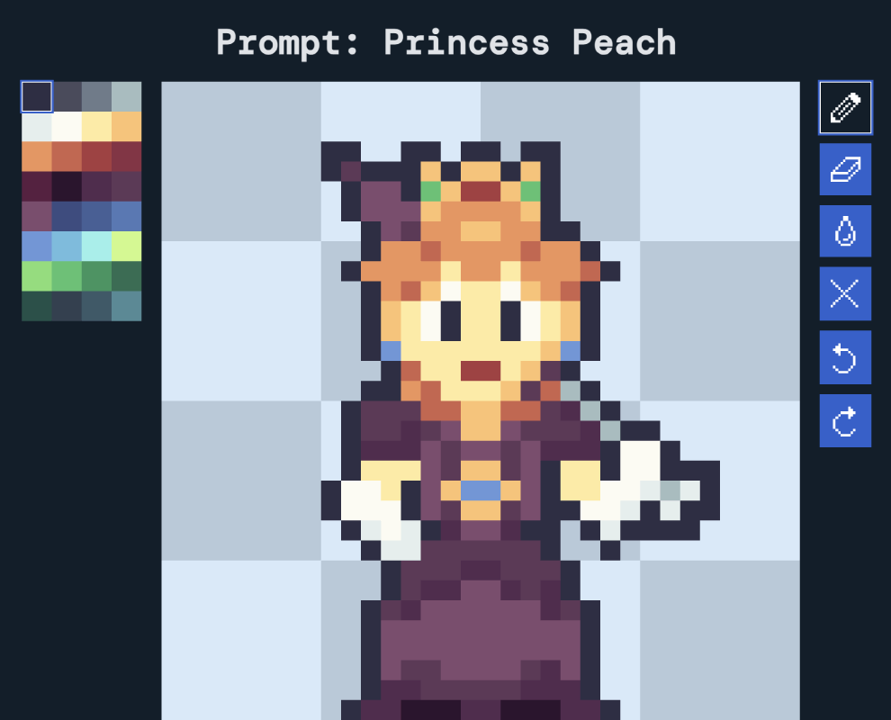
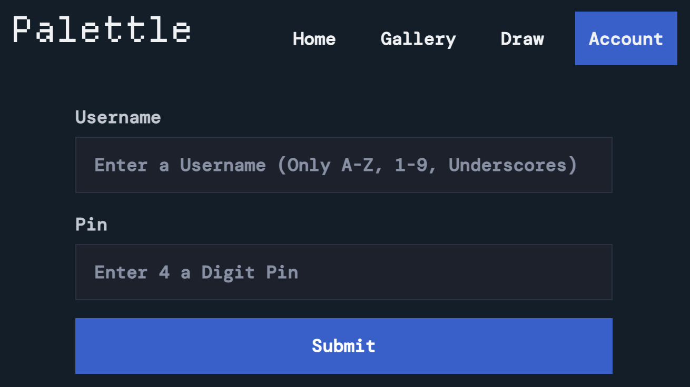

# Palettle

A social web app where users draw new pixel art every day. Get creative with art constraints!


## Features

- Daily Prompts & Color Palettes
- Built-in Pixel Art Editor

    

- Community Art Gallery & Interaction

    

- Account System

    

## Libraries
### Frontend
- HTML/CSS/JS
- Pico.CSS
### Backend
- Flask
- Pandas
- SQLite
## Resources
- [Departure Mono](https://departuremono.com/)
- [DM Mono](https://fonts.google.com/specimen/DM+Mono)
- [Remix Icon](https://remixicon.com/)
- [Lospec](https://lospec.com) Color Palettes

## Getting Started

1. Clone the repository and move into it

```
git clone https://github.com/razradev/palettle.git && cd ./palettle
```

2. Install dependencies

```
pip install -r requirements.txt
```

3. Generate the databases
```
python create_database.py
```

4. Run Palettle
```
python app.py
```

5. [Open the website at http://127.0.0.1:5000](http://127.0.0.1:5000/)

## Author
Matthew Ives